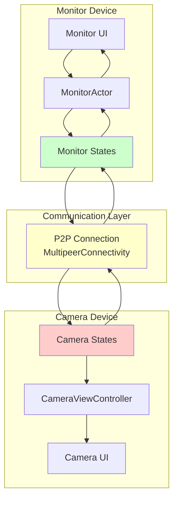
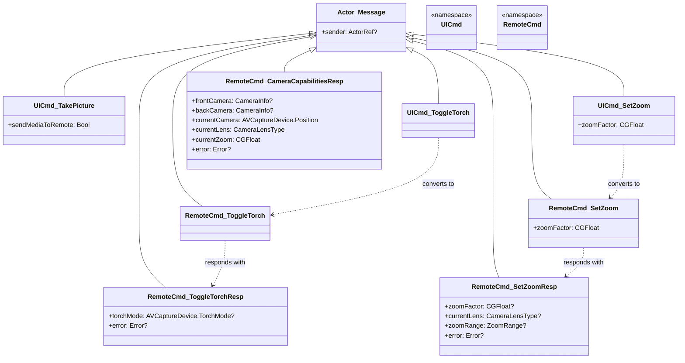
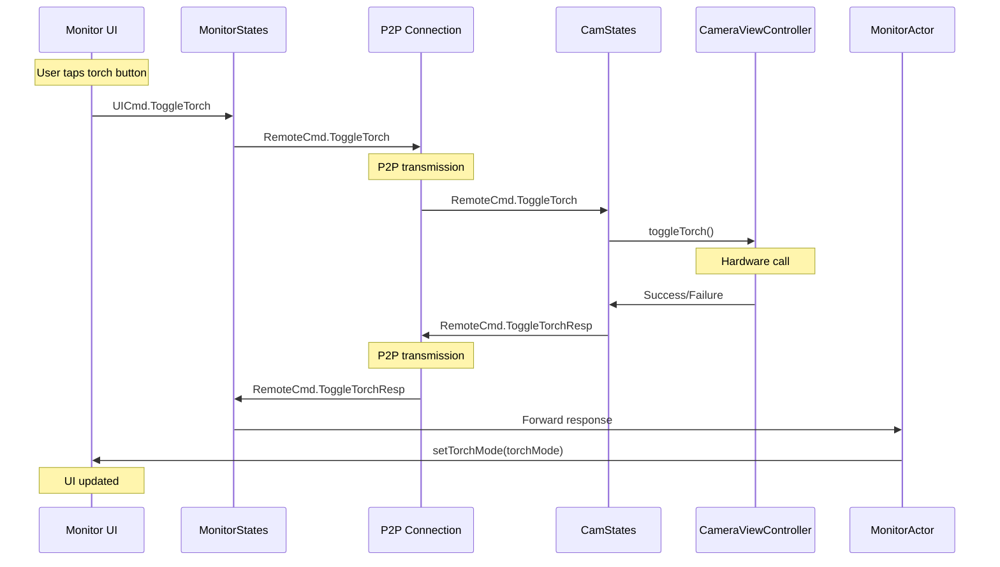
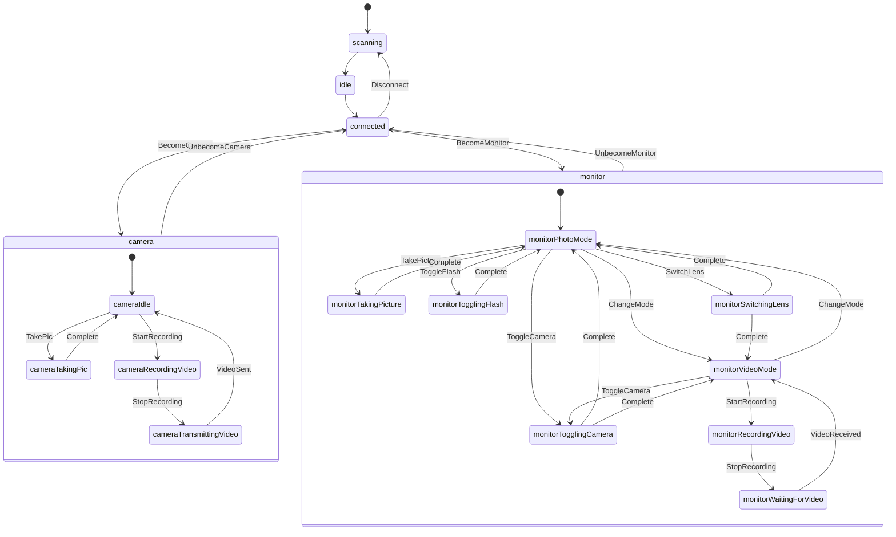
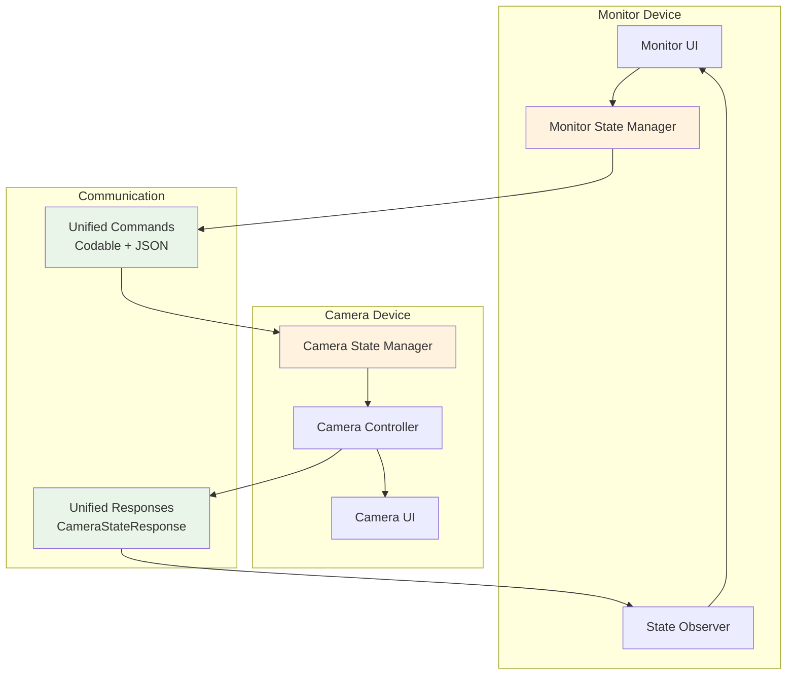
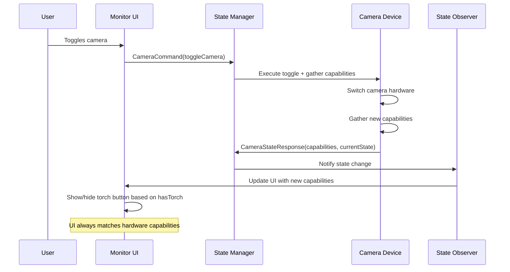

# Remote Shutter Architecture Analysis

## Table of Contents
1. [Overview](#overview)
2. [Current Architecture](#current-architecture)
3. [Command System](#command-system)
4. [State Management](#state-management)
5. [Communication Layer](#communication-layer)
6. [Issues Identified](#issues-identified)
7. [Proposed Improvements](#proposed-improvements)
8. [Migration Strategy](#migration-strategy)

## Overview

Remote Shutter is a peer-to-peer camera control application that allows one iOS device to remotely control another device's camera. The app uses MultipeerConnectivity for P2P communication and an Actor-based state machine architecture for managing device roles and operations.

### Key Components
- **Camera Device**: Captures photos/videos and controls hardware
- **Monitor Device**: Provides remote control interface
- **P2P Communication**: MultipeerConnectivity framework
- **Actor System**: Theater framework for state management

## Current Architecture

### System Architecture Diagram


### Core Components

#### 1. Actor System (Theater Framework)
- **RemoteCamSession**: Main session actor managing device state
- **MonitorActor**: Handles monitor-side UI updates
- **FrameSender**: Manages video frame transmission
- **ViewCtrlActor**: Base class for view controller actors

#### 2. State Machines
- **CamStates**: Camera device state management
- **MonitorStates**: Monitor device state management
- **MonitorPhotoStates**: Photo mode specific states
- **MonitorVideoStates**: Video mode specific states
- **CameraVideoStates**: Camera video recording states

#### 3. View Controllers
- **CameraViewController**: Camera hardware control and preview
- **MonitorViewController**: Remote control interface
- **DeviceScannerViewController**: Device discovery and connection

## Command System

### Current Command Structure

#### UI Commands (UICmd)
Local commands within a device:
```swift
UICmd.TakePicture(sendMediaToRemote: Bool)
UICmd.ToggleCamera()
UICmd.ToggleFlash()
UICmd.ToggleTorch()
UICmd.SetZoom(zoomFactor: CGFloat)
UICmd.SwitchLens(lensType: CameraLensType)
UICmd.RequestCameraCapabilities()
UICmd.BecomeCamera(ctrl: CameraViewController)
UICmd.BecomeMonitor(mode: RecordingMode)
```

#### Remote Commands (RemoteCmd)
P2P commands between devices:
```swift
RemoteCmd.TakePic(sendMediaToPeer: Bool)
RemoteCmd.ToggleCamera()
RemoteCmd.ToggleFlash()
RemoteCmd.ToggleTorch()
RemoteCmd.SetZoom(zoomFactor: CGFloat)
RemoteCmd.SwitchLens(lensType: CameraLensType)
RemoteCmd.StartRecordingVideo()
RemoteCmd.StopRecordingVideo(sendMediaToPeer: Bool)
RemoteCmd.SendFrame(data: Data, fps: Int, camPosition: AVCaptureDevice.Position)
RemoteCmd.RequestCameraCapabilities()
```

#### Response Commands
```swift
RemoteCmd.TakePicResp(pic: Data?, error: Error?)
RemoteCmd.ToggleCameraResp(cameraCapabilities: CameraCapabilitiesResp?, error: Error?)
RemoteCmd.ToggleFlashResp(flashMode: AVCaptureDevice.FlashMode?, error: Error?)
RemoteCmd.ToggleTorchResp(torchMode: AVCaptureDevice.TorchMode?, error: Error?)
RemoteCmd.SetZoomResp(zoomFactor: CGFloat?, currentLens: CameraLensType?, zoomRange: ZoomRange?, error: Error?)
RemoteCmd.SwitchLensResp(lensType: CameraLensType?, availableLenses: [CameraLensType]?, currentZoom: CGFloat?, zoomRange: ZoomRange?, error: Error?)
RemoteCmd.CameraCapabilitiesResp(frontCamera: CameraInfo?, backCamera: CameraInfo?, currentCamera: AVCaptureDevice.Position, currentLens: CameraLensType, currentZoom: CGFloat, error: Error?)
```

### Current Command Structure Diagram


### Command Flow Example


## State Management

### Device States



```swift
struct RemoteCamStates {
    let scanning = "scanning"                    // Looking for peers
    let idle = "idle"                           // No active connection
    let connected = "connected"                 // Connected but no role
    let camera = "camera"                       // Acting as camera
    let monitor = "monitor"                     // Acting as monitor
    let cameraTakingPic = "cameraTakingPic"     // Camera taking photo
    let cameraRecordingVideo = "cameraRecordingVideo"  // Camera recording
    let cameraTransmittingVideo = "cameraTransmittingVideo"  // Sending video
    let monitorTakingPicture = "monitorTakingPicture"  // Monitor requesting photo
    let monitorTogglingFlash = "monitorTogglingFlash"  // Monitor changing flash
    let monitorTogglingCamera = "monitorTogglingCamera"  // Monitor switching camera
    let monitorRecordingVideo = "monitorRecordingVideo"  // Monitor recording
    let monitorPhotoMode = "monitorPhotoMode"   // Monitor in photo mode
    let monitorVideoMode = "monitorVideoMode"   // Monitor in video mode
    let monitorWaitingForVideo = "monitorWaitingForVideo"  // Waiting for video data
    let monitorSwitchingLens = "monitorSwitchingLens"  // Monitor switching lens
}
```

### Camera Capabilities Structure
```swift
struct CameraInfo {
    let availableLenses: [CameraLensType]
    let hasFlash: Bool
    let hasTorch: Bool
    let zoomCapabilities: [CameraLensType: ZoomRange]
}

struct CameraCapabilitiesResp {
    let frontCamera: CameraInfo?
    let backCamera: CameraInfo?
    let currentCamera: AVCaptureDevice.Position
    let currentLens: CameraLensType
    let currentZoom: CGFloat
    let error: Error?
}
```

## Communication Layer

### Current Serialization (NSCoding)
```swift
public func sendMessage(peer: [MCPeerID], msg: Actor.Message, mode: MCSessionSendDataMode = .reliable) -> Try<Message> {
    do {
        let serializedMessage = try NSKeyedArchiver.archivedData(withRootObject: msg, requiringSecureCoding: false)
        try self.session.send(serializedMessage, toPeers: peer, with: mode)
        return Success(msg)
    } catch let error as NSError {
        return Failure(error: error)
    }
}
```

### Message Examples
Commands implement NSCoding protocol:
```swift
@objc public class SetZoom: Actor.Message, NSCoding {
    public let zoomFactor: CGFloat
    
    public func encode(with aCoder: NSCoder) {
        aCoder.encode(Float(zoomFactor), forKey: "zoomFactor")
    }
    
    public required init?(coder aDecoder: NSCoder) {
        self.zoomFactor = CGFloat(aDecoder.decodeFloat(forKey: "zoomFactor"))
        super.init(sender: nil)
    }
}
```

## Issues Identified

### 1. State Synchronization Problems
**Issue**: UI state doesn't always match camera capabilities
- **Example**: Torch button shown when camera doesn't have torch
- **Root Cause**: Incomplete capability reporting during camera transitions
- **Impact**: User sees controls for unavailable features

**Current Evidence**:
```swift
// In MonitorActor - torch response handling
case let torch as RemoteCmd.ToggleTorchResp:
    OperationQueue.main.addOperation {[weak ctrl] in
        if let ctrl = ctrl {
            setTorchMode(ctrl: ctrl, torchMode: torch.torchMode)
        }
    }
```
No validation if torch is actually available on current camera.

### 2. Inconsistent API Design
**Issue**: Some commands return capabilities, others don't

**Examples**:
- ✅ `ToggleCameraResp` includes full `cameraCapabilities`
- ❌ `ToggleTorchResp` only includes `torchMode`
- ❌ `ToggleFlashResp` only includes `flashMode`
- ✅ `SwitchLensResp` includes `availableLenses` and `zoomRange`

**Impact**: UI can become out of sync because it doesn't receive updated capability information.

### 3. Race Conditions
**Issue**: Capabilities may not be ready when requested

**Current Workaround**:
```swift
private func attemptToSendCapabilities(ctrl: CameraViewController, peer: MCPeerID, attempt: Int, maxAttempts: Int) {
    ctrl.gatherAllCameraCapabilities()
    if let capabilities = ctrl.gatherCurrentCameraCapabilities() {
        // Success
    } else if attempt < maxAttempts {
        let delay = Double(attempt) * 0.2 // Retry with increasing delay
        DispatchQueue.main.asyncAfter(deadline: .now() + delay) { [weak self] in
            self?.attemptToSendCapabilities(ctrl: ctrl, peer: peer, attempt: attempt + 1, maxAttempts: maxAttempts)
        }
    }
}
```

### 4. Complex Command Flow
**Issue**: Commands pass through 7+ steps


**Impact**: Difficult to debug, maintain, and reason about

### 5. Missing Error Handling
**Issue**: UI doesn't always reflect command failures

**Example**:
```swift
case is UICmd.ToggleTorch:
    // Handle torch toggle directly in photo mode
    if let f = self.sendMessage(peer: [peer], msg: RemoteCmd.ToggleTorch()) as? Failure {
        print("❌ DEBUG: Failed to send torch toggle command in photo mode: \(f.tryError.localizedDescription)")
    }
```
Error is logged but UI is not updated to reflect the failure.

### 6. Legacy Serialization
**Issue**: Using NSCoding instead of modern Codable
- Manual encode/decode implementation
- Not type-safe
- Difficult to debug (binary format)
- Not cross-platform compatible

## Proposed Improvements

### 1. Unified Camera State Response
Every camera command should return standardized state:

```swift
struct CameraStateResponse: Codable {
    let commandId: UUID?
    let capabilities: CameraCapabilities
    let currentState: CameraCurrentState
    let error: CameraError?
    let timestamp: Date
}

struct CameraCapabilities: Codable {
    let frontCamera: CameraInfo?
    let backCamera: CameraInfo?
}

struct CameraCurrentState: Codable {
    let position: AVCaptureDevice.Position
    let currentLens: CameraLensType
    let currentZoom: CGFloat
    let flashMode: AVCaptureDevice.FlashMode?
    let torchMode: AVCaptureDevice.TorchMode?
    let isRecording: Bool
}
```

### 2. Streamlined Command API
```swift
struct CameraCommand: Codable {
    let id: UUID
    let action: CameraAction
    let timestamp: Date
}

enum CameraAction: Codable {
    case toggleCamera
    case toggleTorch
    case toggleFlash
    case setZoom(CGFloat)
    case switchLens(CameraLensType)
    case requestState
    case takePicture(sendToRemote: Bool)
    case startRecording
    case stopRecording(sendToRemote: Bool)
}
```

### Proposed Architecture Diagram


### 3. Modern Serialization with Codable
```swift
// Replace NSCoding with Codable + JSON
public func sendMessage<T: Codable>(peer: [MCPeerID], msg: T, mode: MCSessionSendDataMode = .reliable) -> Try<T> {
    do {
        let encoder = JSONEncoder()
        encoder.dateEncodingStrategy = .iso8601
        let serializedMessage = try encoder.encode(msg)
        try self.session.send(serializedMessage, toPeers: peer, with: mode)
        return Success(msg)
    } catch let error as NSError {
        return Failure(error: error)
    }
}
```

### 4. Reactive State Management
```swift
protocol CameraStateObserver: AnyObject {
    func cameraStateDidChange(_ state: CameraStateResponse)
}

class CameraStateManager {
    private var observers: [WeakRef<CameraStateObserver>] = []
    private var currentState: CameraStateResponse?
    
    func addObserver(_ observer: CameraStateObserver) {
        observers.append(WeakRef(observer))
        // Immediately send current state
        if let state = currentState {
            observer.cameraStateDidChange(state)
        }
    }
    
    func updateState(_ newState: CameraStateResponse) {
        currentState = newState
        notifyObservers(newState)
    }
}
```

### 5. Enhanced Error Handling
```swift
enum CameraError: Codable, Error {
    case hardwareNotAvailable(feature: String)
    case commandFailed(command: String, reason: String)
    case stateInconsistent(expected: String, actual: String)
    case connectionLost
    case permissionDenied(permission: String)
    case deviceBusy(operation: String)
}
```

## Migration Strategy

### Phase 1: State Response Standardization
1. ✅ Create unified `CameraStateResponse` structure
2. ✅ Update `CameraViewController` to always return complete state
3. ✅ Modify all command handlers to use new response format
4. ✅ Add state validation in UI updates

### Phase 2: Command API Streamlining  
1. ✅ Create unified command/response interfaces
2. ✅ Implement command validation before execution
3. ✅ Add comprehensive error handling
4. ✅ Add command correlation (request/response matching)

### Phase 3: Modern Serialization
1. ✅ Implement Codable support alongside NSCoding
2. ✅ Update P2P communication layer
3. ✅ Migrate commands one by one
4. ✅ Remove NSCoding dependencies

### Phase 4: Reactive State Management
1. ✅ Implement state observer pattern
2. ✅ Replace pull-based requests with push-based updates
3. ✅ Add state consistency validation
4. ✅ Implement automatic UI binding

### Phase 5: UI State Binding & Error Handling
1. ✅ Bind UI components to state responses
2. ✅ Implement automatic UI updates on state changes
3. ✅ Add visual feedback for state transitions
4. ✅ Implement comprehensive error reporting

## Benefits of Proposed Architecture

1. **Consistent State**: UI always reflects actual camera capabilities
2. **Simplified Debugging**: Single source of truth for camera state
3. **Reduced Race Conditions**: Push-based updates eliminate timing issues
4. **Better Error Handling**: Clear error propagation and recovery
5. **Easier Testing**: Predictable state transitions
6. **Modern Serialization**: Type-safe, debuggable JSON messages
7. **Future-Proof**: Extensible for new camera features
8. **Cross-Platform**: JSON format works with other platforms

## Specific Resolution: Torch Button Issue

With the new architecture, the torch button issue would be resolved because:

1. **Every camera operation** returns complete `CameraStateResponse` with current capabilities
2. **Monitor UI** automatically updates based on `CameraCapabilities.getCurrentCameraInfo().hasTorch`
3. **State validation** prevents showing controls for unavailable features
4. **Error handling** gracefully handles capability mismatches
5. **Reactive updates** ensure UI consistency without manual synchronization

**Example Flow**:


```swift
// Simplified flow
1. MonitorViewController.onToggleCamera() 
2. → CameraCommand(action: .toggleCamera)
3. → Camera executes toggle + gathers capabilities
4. → CameraStateResponse(capabilities: newCapabilities, currentState: newState)
5. → MonitorViewController receives state update
6. → UI automatically shows/hides torch button based on newCapabilities.hasTorch
```

This eliminates the current issue where UI controls can be out of sync with actual hardware capabilities. 