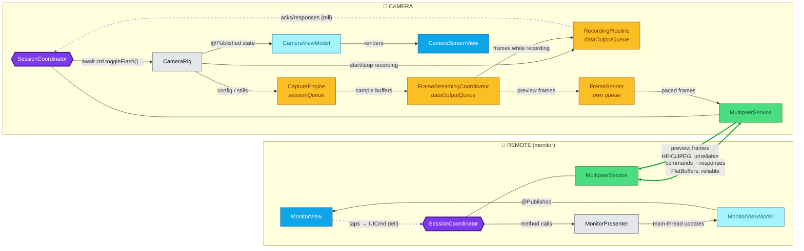
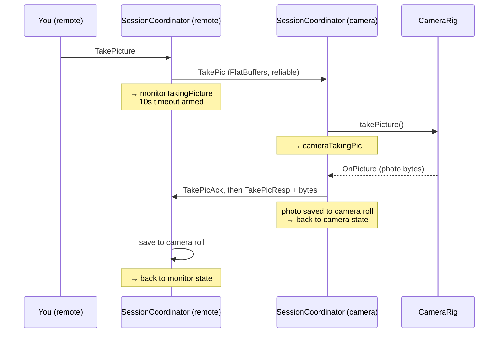

# Remote Shutter — Architecture

Two Apple devices, one photo shoot: one phone is the **camera**, the other is the
**remote** (monitor). They find each other over peer-to-peer Wi-Fi/Bluetooth
(MultipeerConnectivity), the remote sees a live preview, and every camera control —
shutter, video, zoom, lens, flash, torch, quality — works from across the room.
An Apple Watch can also drive the camera directly (no second phone needed).

## The big picture

**Boxes** — 🟪 purple hexagon: **Swift `actor`** (compiler-serialized) ·
🟨 amber: **queue-confined worker** (owns a serial `DispatchQueue`) ·
🟦 blue: SwiftUI view · 🩵 cyan: view model (`ObservableObject`, main thread) ·
🟩 green: transport · ⬜ gray: plain class.

**Lines** — ━━ **thick green**: MultipeerConnectivity radio (FlatBuffers) ·
┄┄ **dashed purple**: message into the actor's FIFO inbox (`tell`) ·
── thin: direct method call.

UIKit shells (thin view controllers hosting each SwiftUI view) are omitted for
clarity. Every box owns its state and is driven from exactly one place; the
whole suite runs clean under Thread Sanitizer.

## What happens when you tap the shutter

Every command follows this shape: a `UICmd` from the screen, a `RemoteCmd` across
the wire, a state transition on both sides, and a response that pops the transient
state (or a 10-second timeout that pops it anyway).

## The three load-bearing pieces

**`SessionCoordinator`** — a Swift `actor` holding the session state machine as an
enum (~20 states: scanning, connected, camera/monitor families, watch family).
Messages enter a FIFO inbox and are processed one at a time; adding an event the
compiler can't match against every state is a build error. One instance per device;
it owns the transport and routes everything.

**The capture stack** — `CameraRig` bundles three non-UI workers around
`AVCaptureSession`: `CaptureEngine` (configuration + stills, confined to its
`sessionQueue`), `RecordingPipeline` (asset writer + recording state, confined to
the single `dataOutputQueue` that delivers both video and audio frames), and
`FrameStreamingCoordinator` (fans each frame out to the live preview and, while
recording, the pipeline). Queue confinement + a one-way hop rule; the only shared
values are a handful of `Locked<T>` boxes on the per-frame hot path.

**The wire** — `MultipeerService` wraps MultipeerConnectivity; every message is a
FlatBuffers table (`FlatBufferSchemas.fbs`). Control messages ship reliable,
preview frames unreliable with credit-window back-pressure (the camera only sends
when the remote has acked), and finished videos transfer as resources with
progress reporting.

## The screens

Every screen is SwiftUI hosted by a thin `UIViewController` shell (navigation,
permissions, lifecycle only): Welcome → Role picker → Device scanner → then
`MonitorView` or `CameraScreenView`. View models are `@MainActor`-fed
`ObservableObject`s; the camera preview is an `AVCaptureVideoPreviewLayer` backing
a `UIViewRepresentable`.

## Watch mode

The same `SessionCoordinator` runs the watch states with **no transport at all**:
the Watch sends commands over `WCSession`, and instead of responses the phone
pushes a full **state snapshot** after every change (readiness, mode, zoom, lenses,
countdown, events). Snapshots-not-events means a Watch that misses a message is
corrected by the next push.

## Testing in one line each

- **`LoopbackSessionTests`** — two real coordinators wired through an in-process
  transport with real FlatBuffers encode/decode: full two-device flows in CI.
- **Snapshot tests** — both screens rendered to PNGs and pixel-checked.
- **`RecordingPipelineTests`** — synthetic sample buffers through the real frame
  path (including the exactly-one-start-ack guarantee).
- **Thread Sanitizer** — the full suite runs under TSan with zero warnings.

---

*History: how the app got here from a 2015 Objective-C/Theater-actor codebase is
recorded in [MODERNIZATION.md](MODERNIZATION.md) (concurrency) and
[UI_MODERNIZATION.md](UI_MODERNIZATION.md) (UI), kept as worklogs.*
