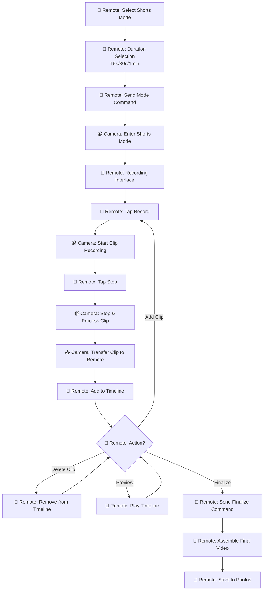
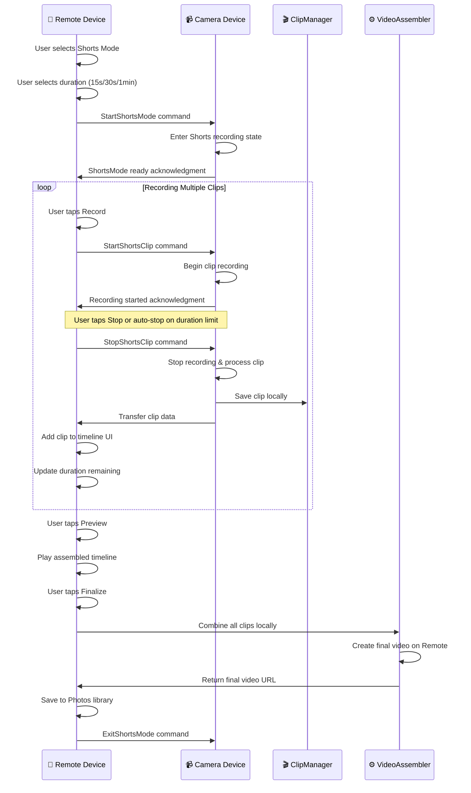
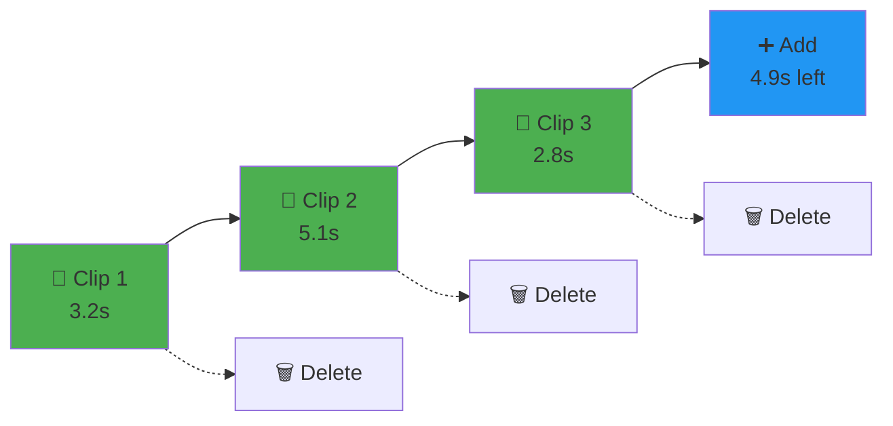
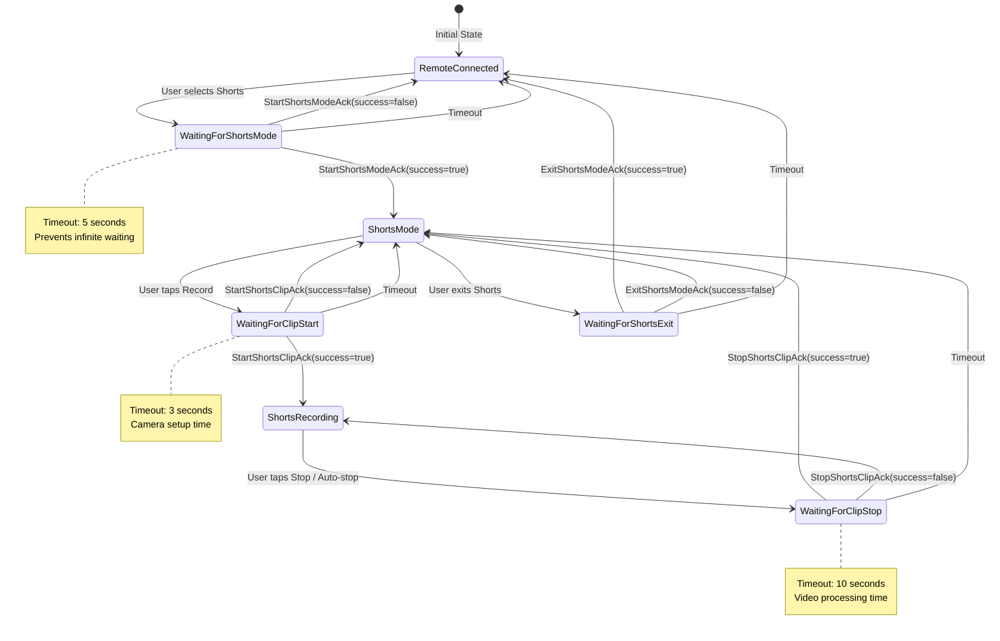

# Remote Shutter - Shorts Mode Design Document

**Version:** 1.1  
**Date:** January 2025  
**Author:** Remote Shutter Development Team  
**Last Updated:** January 2025 - Added robust state machine implementation (Section 9)  

## Table of Contents
1. [Overview](#overview)
2. [System Requirements & Goals](#system-requirements--goals)
3. [User Experience Flow](#user-experience-flow)
4. [Technical Architecture](#technical-architecture)
5. [Data Models](#data-models)
6. [UI Components Design](#ui-components-design)
7. [Implementation Plan](#implementation-plan)
8. [Technical Implementation Details](#technical-implementation-details)
9. [Robust State Machine Implementation](#robust-state-machine-implementation)
10. [Technical Challenges & Solutions](#technical-challenges--solutions)
11. [Future Enhancements](#future-enhancements)
12. [Success Metrics](#success-metrics)

## Overview

This document outlines the design and implementation plan for a TikTok-style short video creation mode in the Remote Shutter app. The feature will leverage the existing remote control functionality to provide an intuitive multi-clip video creation experience.

### High-Level Architecture Flow



## System Requirements & Goals

### Primary Requirements
- **Duration Control**: Support 15s, 30s, and 1-minute total video lengths
- **Multi-Clip Recording**: Allow recording multiple clips that combine into one final video
- **Remote Preview**: Show real-time preview of recorded clips on the remote device
- **Clip Management**: Add, remove, and reorder clips in the timeline
- **Seamless Integration**: Work within existing remote control architecture

### Success Criteria
- Intuitive UI similar to popular short-form video apps
- Smooth clip transitions and preview playback
- Efficient video transfer and processing
- Maintains existing app performance standards

### Feature Flag Integration
The feature is controlled by `FeatureFlags.ENABLE_SHORTS_MODE` in `RemoteCam/FeatureFlags.swift`:

```swift
/// Enable Shorts mode (short-form video recording)
/// Set to true when Shorts mode implementation is complete
static let ENABLE_SHORTS_MODE = false
```

## User Experience Flow

### 2.1 Mode Selection (Remote-Initiated)
1. User selects "Shorts" mode from the **Remote** recording mode picker
2. Duration selection appears on Remote (15s/30s/1min chips)
3. Remote sends command to Camera to enter shorts mode
4. Camera transitions to shorts recording state

### 2.2 Recording Process (Remote-Controlled)
1. **Initial State**: Remote shows empty timeline, record button available
2. **Recording**: User taps record on Remote → Camera starts clip recording
3. **Stop Recording**: User taps stop on Remote (or auto-stop on duration limit)
4. **Clip Transfer**: Camera processes clip and transfers to Remote
5. **Timeline Management**: Remote displays clips in visual timeline, allows deletion
6. **Preview Mode**: Remote plays entire sequence locally before finalizing

### 2.3 Completion (Remote-Handled)
1. When timeline is satisfactory, user taps "Finalize" on Remote
2. Remote assembles final video from locally stored clips
3. Remote saves final video to its own Photos library
4. Remote sends exit command to Camera to return to normal mode

## Technical Architecture

### 3.1 Core Components

```swift
// New Components to Create
ShortsViewController           // Camera-side minimal shorts interface  
ShortsMonitorView             // Remote-side primary shorts interface
ShortsClipManager             // Remote-side: Manages clip collection
ShortsTimelineView            // Remote-side: Visual timeline component
ShortsPreviewPlayer           // Remote-side: Preview playback
ShortsVideoAssembler          // Remote-side: Combines clips into final video
```

### 3.2 Data Flow Architecture



### 3.3 Integration with Existing Systems

#### Actor System Integration
The shorts mode will integrate with the existing Theater framework:
- Extend `RemoteCamSession` to handle shorts-specific messages
- Add new states to `CamStates` and `MonitorVideoStates`
- Leverage existing `MultipeerConnectivity` for clip transfer

#### Video Recording Integration
- Build upon existing `CameraViewController` recording infrastructure
- Reuse `AVAssetWriter` setup from current video recording
- Extend existing video transfer system for clips

#### Architectural Philosophy: Remote-Centric Design
This design follows Remote Shutter's core principle: **the Remote device controls everything, the Camera device is just a recording tool**. Key advantages:

- **Consistent with existing architecture**: Remote already receives and manages photos/videos
- **Better user experience**: Final video appears where user expects it (on their Remote device)
- **Simplified data flow**: No need to send final video back from Camera to Remote
- **Local processing**: Remote can assemble video using clips it already has
- **Storage efficiency**: All content lives on the device the user actually uses (Remote)

## Data Models

### 4.1 Core Data Structures

```swift
// Shorts Configuration
struct ShortsConfig {
    let maxDuration: TimeInterval  // 15, 30, or 60 seconds
    let maxClips: Int = 10         // Reasonable limit
    let minClipDuration: TimeInterval = 0.5
}

// Individual Clip
struct ShortsClip {
    let id: UUID
    let duration: TimeInterval
    let videoURL: URL
    let thumbnailImage: UIImage?
    let recordedAt: Date
    let order: Int
}

// Shorts Session
class ShortsSession {
    let config: ShortsConfig
    private(set) var clips: [ShortsClip] = []
    var totalDuration: TimeInterval { clips.reduce(0) { $0 + $1.duration } }
    var remainingDuration: TimeInterval { config.maxDuration - totalDuration }
    var canAddClip: Bool { remainingDuration > config.minClipDuration }
}
```

### 4.2 Actor Messages (Theater Framework Integration)

```swift
// New Remote Commands (sent from Remote to Camera)
extension RemoteCmd {
    class StartShortsMode: RemoteCmd {
        let config: ShortsConfig
    }
    
    class StartShortsClip: RemoteCmd {
        let maxDuration: TimeInterval
    }
    
    class StopShortsClip: RemoteCmd {}
    
    class ExitShortsMode: RemoteCmd {}
}

// New UI Commands (internal Camera messages and responses to Remote)
extension UICmd {
    class ShortsClipRecorded: UICmd {
        let clipURL: URL
        let duration: TimeInterval
        let thumbnailImage: UIImage?
    }
    
    class ShortsClipTransferStarted: UICmd {
        let clipId: UUID
        let totalBytes: Int64
    }
    
    class ShortsClipTransferProgress: UICmd {
        let clipId: UUID
        let progress: Double
    }
    
    class ShortsClipTransferCompleted: UICmd {
        let clipId: UUID
        let success: Bool
    }
}
```

### 4.3 MonitorViewModel Extensions

```swift
// Extend existing MonitorViewModel with shorts properties
extension MonitorViewModel {
    // MARK: - Shorts Properties
    @Published var shortsSession: ShortsSession?
    @Published var isInShortsMode: Bool = false
    @Published var shortsPreviewClip: ShortsClip?
    @Published var shortsPlaybackTime: TimeInterval = 0
}
```

## UI Components Design

### 5.1 Camera Interface (ShortsViewController)

```swift
// Key UI Elements (Minimal - Camera is primarily controlled by Remote):
- Recording indicator (shows when recording clip)
- Shorts mode indicator 
- Current clip duration timer
- Simple status display (e.g., "Recording Clip 3 of 5")
- Back button to exit shorts mode (if disconnected from remote)
```

### 5.2 Remote Interface (ShortsMonitorView) - Primary Control Interface

```swift
// Key UI Elements (Main control interface):
- Duration selection chips (15s/30s/1min) at top
- Live camera preview (when not recording)
- Large record button (tap to start/stop clips)
- Clips timeline with thumbnails at bottom
- Play/pause controls for timeline preview
- Individual clip delete buttons
- "Finalize" button when ready
- Duration remaining indicator
- Progress bar showing total duration used
```

### 5.3 Timeline Component



### 5.4 UI State Management

Extend the existing `MonitorUIState` enum (already includes `.shortsMode`):

```swift
enum MonitorUIState {
    case photoMode
    case videoMode
    case videoRecording
    case shortsMode        // Already defined
    case shortsRecording   // New
    case shortsPreview     // New
}
```

## Implementation Plan

### 6.1 Phase 1: Core Infrastructure
1. **Enable Feature Flag**
   - Update `FeatureFlags.swift` to enable shorts mode
   - Add shorts mode to recording mode enum

2. **Basic Data Models**
   - Create `ShortsClip`, `ShortsConfig`, `ShortsSession` models
   - Add new Actor messages to support shorts workflow

3. **UI State Management**
   - Extend `MonitorUIState` enum with new shorts states
   - Add shorts-specific view model properties

### 6.2 Phase 2: Camera Implementation
1. **ShortsViewController**
   - New view controller for camera-side shorts interface
   - Integrate with existing `CameraViewController` recording logic
   - Handle clip duration limits and session management

2. **Recording Logic**
   - Modify existing video recording to support clip-based recording
   - Add automatic stop when clip duration limits reached
   - Implement clip thumbnail generation

### 6.3 Phase 3: Remote Implementation
1. **ShortsMonitorView**
   - SwiftUI view for remote shorts interface
   - Timeline component with clip management
   - Preview player for assembled clips

2. **Clip Transfer System**
   - Extend existing video transfer system for clips
   - Add clip metadata transfer
   - Implement progressive preview updates

### 6.4 Phase 4: Video Assembly & Polish (Remote-Side)
1. **ShortsVideoAssembler (Remote-Side)**
   - Combine multiple clips into final video on Remote device
   - Handle smooth transitions between clips
   - Save final video to Remote's Photos library
   - Optimize for various video qualities

2. **UI Polish**
   - Animations and transitions for timeline
   - Loading states during video assembly
   - Progress indicators for clip transfers
   - Error handling and edge cases

## Technical Implementation Details

### 7.1 File Structure (Current Implementation)
```
RemoteCam/
├── ShortsClip.swift                  // Shared models (flat structure per Xcode preference)
├── ShortsConfig.swift                // Shared models
├── ShortsSession.swift               // Shared models
├── ShortsViewController.swift        // Camera-side minimal interface (SwiftUI host)
├── ShortsView.swift                  // Camera-side SwiftUI view
├── ShortsMonitorView.swift           // Remote-side primary interface (SwiftUI)
├── MonitorShortsStates.swift         // Remote-side state machine
├── CamStates.swift                   // Extended with shorts camera states
├── RemoteCmds.swift                  // Extended with shorts commands/acks
├── UICmds.swift                      // Extended with shorts UI commands
├── MonitorViewModel.swift            // Extended with shorts properties
└── MonitorViewController+SwiftUI.swift // Extended with shorts UI integration
```

**Note**: The final implementation uses Xcode's preferred flat file structure rather than nested folders for easier project management.

### 7.2 Integration Points

1. **Recording Mode Selection (Remote-Initiated)**
   - Add shorts option to existing Remote mode picker
   - Remote sends StartShortsMode command to Camera
   - Camera enters ShortsViewController state

2. **Video Recording**
   - Reuse existing `AVAssetWriter` infrastructure
   - Modify to support short clip durations
   - Add automatic stop functionality

3. **Remote Communication**
   - Extend existing MultipeerConnectivity system
   - Add new message types for shorts workflow
   - Reuse video transfer system for clips

### 7.3 Video Assembly Strategy (Remote-Side)

```swift
// This runs on the Remote device using locally stored clips
class ShortsVideoAssembler {
    func assembleClips(_ clips: [ShortsClip]) async throws -> URL {
        let composition = AVMutableComposition()
        var currentTime = CMTime.zero
        
        for clip in clips.sorted(by: { $0.order < $1.order }) {
            // clips[].videoURL points to local Remote storage
            let asset = AVAsset(url: clip.videoURL)
            let timeRange = CMTimeRange(start: .zero, duration: asset.duration)
            
            try composition.insertTimeRange(
                timeRange,
                of: asset,
                at: currentTime
            )
            
            currentTime = CMTimeAdd(currentTime, asset.duration)
        }
        
        // Export final video to Remote's Documents/Temp directory
        return try await exportComposition(composition)
    }
    
    private func exportComposition(_ composition: AVMutableComposition) async throws -> URL {
        // Save final video to Remote device's storage
        // Then save to Remote's Photos library
    }
}
```

### 7.4 Existing System Extensions

#### Extend CameraViewController
```swift
extension CameraViewController {
    func startShortsClipRecording(maxDuration: TimeInterval) {
        // Reuse existing video recording logic
        // Add duration timer for automatic stop
    }
    
    func stopShortsClipRecording() -> URL? {
        // Return clip URL for processing
    }
}
```

#### Extend MonitorViewModel (Remote-Side)
```swift
extension MonitorViewModel {
    func configureShortsMode() {
        DispatchQueue.main.async {
            self.uiState = .shortsMode
            self.isRecording = false
            self.shortsSession = ShortsSession(config: selectedConfig)
            // Configure shorts-specific UI state
        }
    }
    
    func finalizeShorts() async throws {
        guard let session = shortsSession else { return }
        
        // Assemble video locally on Remote using stored clips
        let assembler = ShortsVideoAssembler()
        let finalVideoURL = try await assembler.assembleClips(session.clips)
        
        // Save to Remote's Photos library
        try await saveVideoToPhotos(finalVideoURL)
        
        // Clean up and exit shorts mode
        await exitShortsMode()
    }
}
```

## Robust State Machine Implementation

### 7.5 State Coordination Pattern (Critical Architecture Decision)

**Problem Identified**: Initial implementation used ad-hoc state management that led to:
- Camera not stopping recording properly
- Broken mode transitions (Video ↔ Shorts)
- Remote and Camera getting out of sync
- Race conditions during state changes

**Solution**: Implemented robust request/acknowledgment pattern following the existing video recording architecture.

#### 7.5.1 Request/Acknowledgment Commands

Following the proven video recording pattern, all shorts mode operations use explicit acknowledgments:

```swift
// Remote Commands (Request)
extension RemoteCmd {
    class StartShortsMode: RemoteCmd { /* config */ }
    class StartShortsClip: RemoteCmd { /* maxDuration */ }
    class StopShortsClip: RemoteCmd { }
    class ExitShortsMode: RemoteCmd { }
}

// Remote Commands (Acknowledgment) 
extension RemoteCmd {
    class StartShortsModeAck: RemoteCmd { 
        let success: Bool
        let error: String?
    }
    class StartShortsClipAck: RemoteCmd { 
        let success: Bool
        let clipId: UUID?
        let error: String?
    }
    class StopShortsClipAck: RemoteCmd { 
        let success: Bool
        let clipURL: URL?
        let duration: TimeInterval
        let error: String?
    }
    class ExitShortsModeAck: RemoteCmd { 
        let success: Bool
        let error: String?
    }
}

// UI Commands (Internal)
extension UICmd {
    class StartShortsClip: UICmd { }
    class StopShortsClip: UICmd { }
    class RenderShortsRecording: UICmd { }
    class ExitShortsMode: UICmd { }
}
```

#### 7.5.2 State Machine Flow



#### 7.5.3 Camera State Machine

```swift
// Camera follows complementary state pattern
func camera(peer: MCPeerID, ctrl: CameraViewController) -> Receive {
    // Handles: StartShortsMode → send StartShortsModeAck
    // Transitions to: cameraShortsMode state
}

func cameraShortsMode(peer: MCPeerID, ctrl: ShortsViewController) -> Receive {
    // Handles: StartShortsClip → send StartShortsClipAck
    // Handles: StopShortsClip → send StopShortsClipAck  
    // Handles: ExitShortsMode → send ExitShortsModeAck
    // Transitions to: camera state on exit
}
```

#### 7.5.4 Error Handling & Recovery

**Timeout Handling**: Each waiting state has timeout to prevent deadlock
```swift
case OnEnter:
    // Start timeout timer
    DispatchQueue.main.asyncAfter(deadline: .now() + timeoutDuration) {
        if self.currentStateName == waitingStateName {
            self.handleTimeout()
        }
    }
```

**Error States**: Graceful degradation on failures
```swift
case let ack as RemoteCmd.StartShortsModeAck:
    if ack.success {
        self.become(state: shortsMode)
    } else {
        self.monitorViewModel.error = ack.error
        self.become(state: connected) // Fallback to safe state
    }
```

**State Isolation**: Each mode properly cleans up on exit
```swift
case OnExit:
    self.monitorViewModel.isInShortsMode = false
    self.monitorViewModel.isRecording = false
    self.monitorViewModel.shortsSession = nil
    // Clear all shorts-specific state
```

#### 7.5.5 Critical Design Principles

1. **No Assumptions**: Every state change requires explicit acknowledgment
2. **Timeout Protection**: All waiting states have timeouts to prevent deadlock  
3. **Error Recovery**: Failed operations return to safe known states
4. **State Isolation**: Modes don't leak state into each other
5. **Following Patterns**: Uses proven video recording coordination approach

#### 7.5.6 Implementation Files

- **`MonitorShortsStates.swift`**: Remote-side state machine with waiting states
- **`CamStates.swift`**: Camera-side state handlers with acknowledgments  
- **`RemoteCmds.swift`**: All request/acknowledgment command definitions
- **`UICmds.swift`**: Internal UI state coordination commands

This robust architecture ensures reliable state coordination and prevents the sync issues that plagued the initial implementation.

## Technical Challenges & Solutions

### 8.1 Video Synchronization
**Challenge**: Ensuring smooth playback when combining clips with different frame rates/resolutions
**Solution**: Normalize all clips to consistent format during recording, use AVComposition for seamless assembly

### 8.2 Memory Management
**Challenge**: Multiple video clips in memory simultaneously
**Solution**: Stream clips on-demand, use background queues for processing, implement clip caching strategy

### 8.3 Network Transfer Efficiency
**Challenge**: Transferring multiple video clips over MultipeerConnectivity
**Solution**: Compress clips during transfer, implement progressive loading, use existing robust transfer system. Since Remote handles final assembly, each clip only needs to be transferred once (Camera → Remote), not back and forth.

### 8.4 User Experience Consistency
**Challenge**: Maintaining familiar Remote Shutter UX while adding complex shorts functionality
**Solution**: Reuse existing UI patterns, maintain consistent navigation flow, leverage current SwiftUI architecture

### 8.5 Code Organization
**Challenge**: Maintaining file size limits (200-300 lines) while implementing complex functionality
**Solution**: Separate concerns into focused components, use extensions for related functionality, maintain clean architecture

## Future Enhancements

### 11.1 Advanced Features
- **Clip Reordering**: Drag-and-drop timeline management
- **Basic Filters**: Simple color/brightness adjustments
- **Audio Control**: Background music, volume adjustment
- **Speed Control**: Slow motion, time-lapse clips

### 11.2 Performance Optimizations  
- **Background Processing**: Assemble videos in background
- **Smart Caching**: Intelligent clip storage management
- **Quality Adaptation**: Adjust quality based on device capabilities

### 11.3 Social Features
- **Export Options**: Various aspect ratios and qualities
- **Sharing Integration**: Direct social media sharing
- **Template System**: Pre-defined duration/transition templates

## Success Metrics

### 12.1 Technical Metrics
- Clip recording accuracy (within 100ms of target duration)
- Transfer success rate >95% for clips
- Assembly time <5 seconds for 1-minute video
- Memory usage stays within existing app limits

### 12.2 User Experience Metrics
- Time to create first shorts video <2 minutes
- Error rate during shorts creation <5%
- User retention when shorts feature is available

### 12.3 Performance Benchmarks
- App launch time impact <500ms
- UI responsiveness maintained (60fps)
- Battery usage increase <20% during shorts recording

## Development Guidelines

### Code Quality Standards
- Maintain file sizes between 200-300 lines maximum
- Follow existing architecture patterns
- Use proper separation of concerns
- Commit frequently with clear documentation

### Testing Strategy
- Unit tests for all data models and managers
- Integration tests for video assembly
- UI tests for critical user flows
- Performance testing for video operations

### Compilation Requirements
All changes must compile successfully using:
```bash
xcodebuild \
  -workspace RemoteShutter.xcworkspace \
  -scheme RemoteCam \
  -destination 'platform=iOS Simulator,OS=18.3.1,name=iPhone 16' \
  -configuration Debug \
  clean build \
  CODE_SIGNING_REQUIRED=NO \
  CODE_SIGNING_ALLOWED=NO
```

## Conclusion

This design provides a comprehensive foundation for implementing the shorts mode while maintaining the app's existing quality standards and user experience. The phased approach allows for iterative development and testing, ensuring each component works reliably before moving to the next phase.

The implementation leverages existing robust systems (MultipeerConnectivity, Actor framework, SwiftUI architecture) while adding the specialized functionality needed for short-form video creation.

---

**Next Steps**: This design document should be reviewed and approved before beginning Phase 1 implementation. Any modifications to the design should be documented here with version updates. 