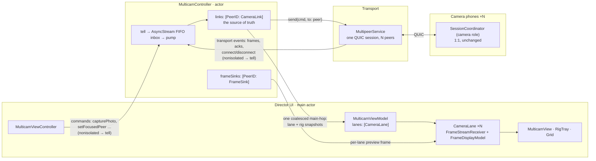
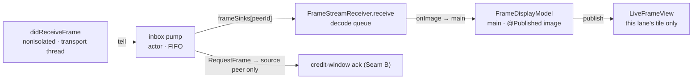
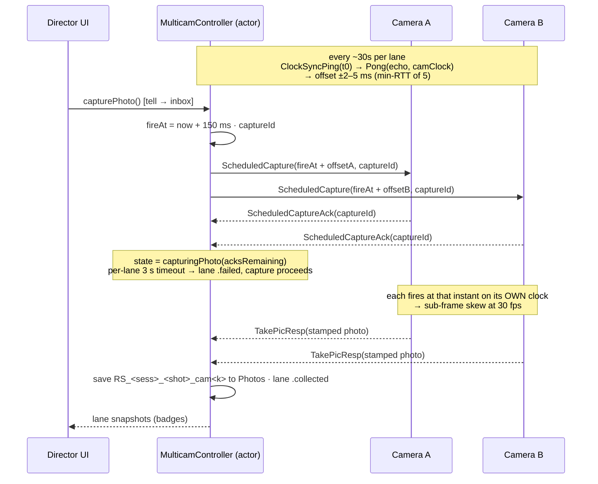
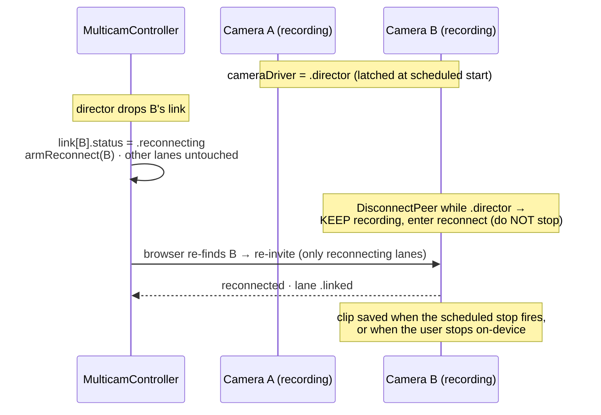

# Multicam Director mode — architecture

One phone (the **director**) drives up to four camera phones over the existing
Stormo/QUIC transport, showing a live preview of every angle and firing
**synchronized** photo capture and video recording across all of them. Each
camera saves full-resolution media locally; the footage then auto-collects to
the director, stamped with alignment metadata so any editor can line the angles
up.

The shape is deliberately lopsided: **one director actor, N unchanged 1:1
cameras.** A camera runs the same `SessionCoordinator` it always has — it never
learns it is one of several. Everything multicam lives on the director, in
`MulticamController`. A single-camera session never enters this code at all: the
scanner hands off to `MulticamController` only when two or more cameras connect,
and every wire message here is gated on a `supports_multicam` capability flag,
so a 9.0.x phone pairs as an ordinary single camera.

> Free tier = 2 cameras, Pro = 4. The whole feature is behind
> `FeatureFlags.ENABLE_MULTICAM`.

## Components & connections

Four isolation domains. The director's UI is main-actor; `MulticamController` is
an actor with a single FIFO inbox; the transport is shared; each camera is its
own process on its own phone.



The load-bearing property: **both** UI commands and transport events enter the
actor the same way — a `nonisolated` method that calls `tell(_:)`, appending to
one `AsyncStream`. A single pump task (`for await msg in stream`) processes them
one at a time, in arrival order. There is no second door. See
[Design rules](#design-rules).

## The camera link — one source of truth per camera

`CameraLink` (a `final class`, actor-confined) is the only place a camera's
state is declared: status, capabilities, clock estimator, capture outcome,
recording flag, stream profile, collection progress. The UI is a projection of
it:

```
CameraLink (actor truth)
   │  snapshot  (one computed property)
   ▼
MulticamLaneInfo (Sendable value)
   │  one coalesced hop to main
   ▼
CameraLane (@Published)  →  SwiftUI tile
```

Mutations never publish by hand. After every pump message the controller
re-derives each UI snapshot (lanes, shutter state, rig settings, available
peers) from its state and publishes only the ones whose value changed — one
coalesced hop to main per message. A state change can never be "forgotten" on
the way to the screen, because publishing is a diff of derived state, not a
per-handler call. The rig-settings snapshot in particular is recomputed from
the live lane set every time, so the tray is always the intersection of the
cameras actually in the rig — a camera joining, dropping, or being refused
recomputes it on the same pump turn.

## Live preview — five hops, four domains

A preview frame crosses every isolation boundary exactly once, and lands on
exactly one tile:



Two things make this robust:

- **Rendering isolation.** Each lane owns its own `FrameStreamReceiver` and
  `FrameDisplayModel`, so a frame from camera B publishes into camera B's model
  and re-renders only camera B's tile — never camera A, never the chrome.
- **Sink routing, not display calls.** The actor routes frames through a
  per-lane `@Sendable` closure (`MulticamFrameSink`) registered when the lane is
  created. The actor never calls into a `UIViewController`; it calls a Sendable
  sink that hops to its own decode queue.

## Synced capture — the clock trick

The director never says "everyone shoot now" (that skews by 10–40 ms as the
command arrives at each camera at a different time). It measures each camera's
clock offset and schedules a shutter instant expressed in *that camera's* clock.



Video start and stop ride the same mechanism
(`ScheduledStartRecording` / `ScheduledStopRecording`), so every clip shares a
start and stop anchor and the lengths match. Photos come back inline in
`TakePicResp`; video clips transfer as resources afterward (see
[Known debts](#known-debts)).

## Resilient camera — a drop mid-recording

The one behavior a camera changes in a director session: if the director drops
while recording, the camera keeps rolling instead of stopping. It is gated on an
explicit `CameraDriver` state (`.solo` vs `.director`), latched when the first
scheduled multicam command arrives and cleared only when the session truly ends
— so a single-camera session is byte-identical.



## Design rules

These are the invariants worth preserving through future changes.

- **Single-entry inbox = arrival-order invariant.** Every input — UI command or
  transport event — becomes a message through `tell`. Because there is one
  queue, the actor always sees the world in the order things happened: a shutter
  tap that arrives after a disconnect is processed after it, so it can never fan
  a capture out to a camera the actor already knows is gone. (Contrast: direct
  `await` command methods would interleave with queued events at every `await`.)
- **Commands are requests; results are state.** A command returns nothing and
  cannot fail loudly — it enqueues. Outcomes (captured / failed / reconnecting /
  transferring) arrive later as published `CameraLink` state and render as tile
  badges. The UI is a pure function of that state, not of any command's return.
- **Framing belongs to a camera; the shot belongs to the rig.** Per-camera
  controls (zoom, focus, flash, torch, lens, camera flip) address the *focused*
  camera only. Rig controls (shutter, record, timer, quality/HDR) fan out to
  all. Nothing per-camera ever broadcasts.
- **Rendering isolation per lane.** One decoder and one published image per
  camera; a frame from one camera can only touch its own tile.
- **Additive, gated wire.** Every multicam action (`ClockSyncPing`,
  `ScheduledCapture`, `ScheduledStartRecording`, `ScheduledStopRecording`,
  `SetStreamProfile`, `RequestVideoResend`) is an appended FlatBuffers action
  gated on the `supports_multicam` capability, so old peers pair normally and
  never receive a message they would misread.

## Known debts

Honest list of what is deliberately first-draft, for whoever picks this up next.

- **Fixed-delay transfer stagger.** Auto-collect delays each camera's clip send
  by `(cameraIndex − 1) × staggerSeconds` so N×4K clips don't hit the link at
  once (`SessionCoordinator.handleSendVideoResource`). It is open-loop: if one
  transfer runs long, the next can still overlap. The real fix is
  director-coordinated turn-taking (the director grants "your turn" per lane).
  Worth doing once real-world 4-camera 4K load is observed post-release.
- **`RequestVideoResend` shape.** Retry re-sends `lastMulticamClipURL`, which
  holds only the *last* clip; it reuses `capture_id` loosely and depends on the
  file still existing. Fine for one-clip-at-a-time retry; it would need a real
  per-capture store to retry an older clip.
## Shared vs duplicated (DRY state)

Extracted and shared by both the 1:1 and multicam paths:

- View atoms: `GlassCircleButton`, `ControlCapsule`, `ShutterButton`,
  `CameraSwitchControlView`, `LinkChip`, `ZoomPill`, `MonitorChromeLayout`,
  `MonitorLinkState`.
- `ZoomScaleSeed` — the zoom clamp (the single home of the 5×-wide
  `maxDisplayZoom`) and the capabilities→zoom seed, used by both
  `MonitorViewModel.updateZoomFactor` and `MulticamController.seedZoom`.
- `FocusedCameraControlState` — the flip/torch/flash enablement rules.
  Consumed by `MulticamViewModel` now; the 1:1 `MonitorViewModel` still sets
  its per-mode `@Published` flags imperatively (adopting it there is a
  `configure{Photo,Video,Recording}Mode` restructure, part of the post-9.1
  pass below).

Remaining duplication, by size and disposition:

- **`CaptureModeSelector` (~25 verbatim lines).** The PHOTO/VIDEO capsule
  (`modeSelector`/`modeButton`) is copied byte-for-byte between `MonitorView`
  and `MulticamView`. Extract to one component — its own snapshot-guarded PR
  after this one, because it swaps into `MonitorView`.
- **`PeerSessionCore` (done — small by nature).** `PeerSessionCore.swift` now
  holds the genuinely-identical mechanics both actors share, adopted
  behavior-identical (full suite unchanged): `RemoteCmd.OnFrame(forwarding:from:)`
  (the one duplicated frame-construction block), `PeerAppCompatibility.isCompatible`
  (the director's version gate; the 1:1 keeps `decide` for its verdict-driven
  UI), and `PeerReconnect.scheduleTick` (the delay→tick timer both reconnect
  paths use). What stayed local is **role-specialization, not duplication** —
  the two coordinators are different roles: the camera answers clock pings and
  runs a frame sender; the director measures pongs and routes by peer. Left
  local, by design: the clock role in `didReceiveMessage`, the frame-request
  handler (sender vs no-op), resource transfer (1:1's rich progress + video
  assembly vs the director's per-lane messages), the incompatibility /
  browser-fail presentation policy, the 1:1 datagram warm-up on connect, and
  the reconnect *find/invite/overlay/state* policy (single-peer `.reconnecting`
  state + overlay vs per-lane status). `CameraCapabilityParse` was skipped —
  it drags in `MonitorPresenter`'s view-model writes.
- **`MonitorChromeScaffold` generic.** The chrome arrangement
  (`chrome`/`topBar`/`bottomCluster`/`sideCluster`/`actionCluster`) is mirrored
  structurally. Fold into a slot-closure scaffold in the post-9.1 pass
  (rewrites `MonitorView`'s chrome; needs pixel-identical proof).
- **`CameraCapabilityParse`.** The capabilities read-shape
  (`getCurrentCameraInfo` → lenses/zoom/quality) is duplicated between
  `MonitorPresenter` and `MulticamController`; fold into the same post-9.1
  pass.
