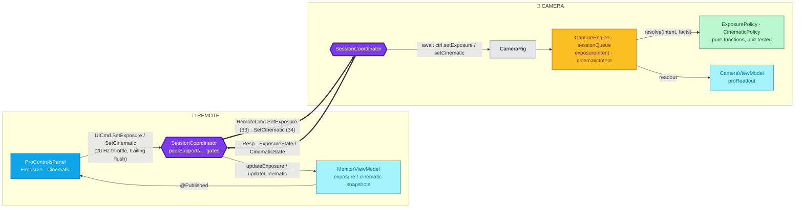

# Pro controls — manual exposure & Cinematic video

Issue [#206](https://github.com/security-union/remote-shutter/issues/206) asks for
"advanced settings": shutter speed for long exposures, ISO, and aperture. This
document covers all three as two remote-driven controls:

- **Manual exposure** — shutter speed + ISO, Auto/Manual, photo and video.
- **Cinematic video** — iOS 26 Cinematic mode with a simulated-aperture dial
  (f/1.4 … f/16 depending on device). This *is* iPhone's "aperture": the
  physical iris is fixed, so Apple exposes depth-of-field as a video effect.

Both follow the shape of tap-to-focus (`FocusAtPoint`, action 22): a
capability-gated wire command, one `CameraControlling` method, one
`sessionQueue`-confined mutation in `CaptureEngine`, and a monitor control
usable by a person standing across the room from the phone.

> Each control is gated on its own capability flag
> (`supports_manual_exposure`, `supports_cinematic_video`), so a 10.0.x camera
> pairs exactly as before and **a button only appears when the connected camera
> offers that feature**. The UI ships behind
> `FeatureFlags.ENABLE_PRO_CONTROLS`; the user-facing unlock mirrors
> tap-to-focus (`StoreManager.hasProControlsFeature()`).

## What Apple actually lets us do

Facts below are from the Xcode 26.6 SDK headers (`AVCaptureDevice.h`,
`AVCaptureInput.h`, `AVCaptureMetadataOutput.h`), not memory.

| Control | API | Availability | Notes |
|---|---|---|---|
| Shutter (exposure duration) | `setExposureModeCustom(duration:iso:)` | iOS 8+, Catalyst 14+ | Range `activeFormat.minExposureDuration…maxExposureDuration` (≈1/10 000 s … ⅓–1 s by device/format). |
| ISO | same call | same | Range `activeFormat.minISO…maxISO`. `AVCaptureDevice.currentISO` / `.currentExposureDuration` change only one. |
| Simulated aperture | `AVCaptureDeviceInput.simulatedAperture` | **iOS 26+, Catalyst 26+** | Only while `isCinematicVideoCaptureEnabled`; range `activeFormat.min/maxSimulatedAperture` (0 = not adjustable); **throws if set during a recording**. |
| Cinematic video | `AVCaptureDeviceInput.isCinematicVideoCaptureEnabled` | iOS 26+ | Requires `activeFormat.isCinematicVideoCaptureSupported`. Effect is rendered into **video data output, movie output, and preview** alike. |
| Exposure bias (EV) | `setExposureTargetBias(_:)` | everywhere | Deferred (see end). |

Constraints that drive the design:

1. **Virtual devices refuse custom exposure.** The header states
   `builtInDualCamera` (and by extension Dual-Wide / Triple) "does not support
   `AVCaptureExposureModeCustom`". `CaptureEngine.preferredCamera(for:)`
   deliberately picks the Triple/Dual-Wide/Dual virtual device for the back
   position so zoom auto-switches lenses. Manual exposure therefore needs the
   **physical constituent** lens.
2. **Shutter and frame rate are coupled.** A duration longer than
   `activeVideoMaxFrameDuration` silently lengthens it (preview fps drops); a
   later frame-rate change shortens the exposure. The engine owns the order
   of operations and never rebuilds frame durations as `CMTimeMake(1, fps)`
   (existing Catalyst invariant).
3. **Cinematic is a session-level reconfiguration, not a device property.**
   Enabling it is "lengthy" and must happen inside
   `beginConfiguration`/`commitConfiguration`; it pins `focusMode` to
   continuous AF (changing it throws); it narrows zoom to
   `videoMin/MaxZoomFactorForCinematicVideo` and frame rate to
   `videoFrameRateRangeForCinematicVideo`; it is incompatible with
   `AVCaptureDepthDataOutput`; and support flips to `false` (auto-disabling
   itself) whenever the camera or format changes.
4. **Ranges are per device *and* per format.** Every lens switch, camera
   toggle, or video-quality change can invalidate the monitor's dials. The
   camera is the source of truth and re-reports ranges + current values after
   any change, exactly as zoom does.

## Components & connections



## Wire protocol (`FlatBufferSchemas.fbs`, append-only)

```
enum ExposureMode : byte { Unknown = 0, Auto = 1, Manual = 2 }

// CommandAction
SetExposure  = 33
SetCinematic = 34

// CommandParameters — appended
exposure_mode: ExposureMode;
exposure_duration_seconds: double;   // 0 = keep current
exposure_iso: float;                 // 0 = keep current
cinematic_enabled: bool;
simulated_aperture: float;           // 0 = keep current

table ExposureState {
  mode: ExposureMode;
  duration_seconds: double;          // currently applied
  iso: float;
  min_duration_seconds: double;      // activeFormat range
  max_duration_seconds: double;
  min_iso: float;
  max_iso: float;
}

table CinematicState {
  enabled: bool;
  simulated_aperture: float;         // currently applied
  min_simulated_aperture: float;     // 0 = fixed aperture, hide the dial
  max_simulated_aperture: float;
  default_simulated_aperture: float;
  aperture_locked: bool;             // true while recording — dial disabled
  not_enough_light: bool;            // from cinematicVideoCaptureSceneMonitoringStatuses
}

// CameraCapabilities — appended
supports_manual_exposure: bool;      // active device supports .custom
exposure: ExposureState;             // so the panel opens populated
supports_cinematic_video: bool;      // iOS 26+ and active format supports it
cinematic: CinematicState;

// CameraStateResponse — appended
exposure: ExposureState;             // echoed on SetExposureResp
cinematic: CinematicState;           // echoed on SetCinematicResp
```

Durations travel as seconds (`double`) and are clamped back into the device's
own `CMTime` range on the camera — the wire never carries a timescale.

`RemoteCmd.SetExposure/Resp`, `RemoteCmd.SetCinematic/Resp` in
`RemoteCmds.swift`; encode/decode in `RemoteCmdFlatBuffers.swift` next to
`SetZoom`. `CameraCapabilitiesResp` gains the two flags and two state tables.
`not_enough_light` is sampled from the device's scene-monitoring statuses
whenever a Cinematic response or capabilities refresh is built — the hint
updates with the next echo rather than by push.

## Monitor → camera path (both controls)

1. **Panel** (`ProControlsPanel` inside `MonitorChrome`). Dragging a dial emits
   `UICmd.SetExposure` / `UICmd.SetCinematic` through the same 20 Hz
   trailing-edge throttle `handleZoomChange` uses. Locked users are routed to
   the paywall before anything is sent (mirrors `handleFocusTap`).
2. **Coordinator send gate** in `.monitor` (photo and video-mode handlers):
   `guard peerSupportsManualExposure` / `guard peerSupportsCinematicVideo`
   else drop → `sendMessage(...)`. No new `SessionState`: like zoom, the
   monitor stays in `.monitor` and absorbs the `Resp` when it arrives, so a
   slow or lost response can never wedge the screen.
3. **Camera handler** (root camera state and video-mode state, next to
   `SetZoom`): `let state = try await ctrl.setExposure(intent)` →
   `sendOrGoToScanning(RemoteCmd.SetExposureResp(state))`; same for
   cinematic.
4. **Rig** forwards to the engine and updates `cameraViewModel.proReadout`.
5. **Engine** (`sessionQueue`, `lockForConfiguration`) — below.

## Engine: intent → policy → apply

`CaptureEngine` stores two values — `exposureIntent` (`.auto` |
`.manual(duration: CMTime, iso: Float)`) and `cinematicIntent` (`.off` |
`.on(aperture: Float?)`) — and exactly one function applies each. The policies
are pure, `Sendable`, table-tested value types; no AVFoundation objects cross
their boundary (they take a `DeviceFacts` struct of ranges and booleans).

### Exposure

```
applyExposureIntentLocked()
  plan = ExposurePolicy.resolve(intent, facts, recording: isRecording)
  .auto:           exposureMode = .continuousAutoExposure; restore frame durations from the last setVideoQuality
  .manual(d, iso): setExposureModeCustom(duration: d, iso: iso)
  .unsupported:    intent = .auto → same as .auto; Resp says mode = Auto
  return ExposureState(device + activeFormat ranges)
```

- clamps duration/ISO into the format's range;
- **while recording** caps duration at the active max frame duration so the
  clip's frame rate never changes mid-take; in photo mode a long shutter may
  slow the preview;
- `isExposureModeSupported(.custom) == false` → `.unsupported`.

**Virtual device → physical lens.** Entering Manual on a virtual device swaps
the input to the physical lens currently in use
(`device.activePrimaryConstituent`, iOS 15+), carrying zoom over by the ratio
of the two zoom spaces; returning to Auto swaps back to
`preferredCamera(for:)`. While Manual is on, zoom is the physical lens's own
range (no auto lens switching); the existing `SetZoomResp` range echo already
informs the monitor's zoom slider.

### Cinematic

```
applyCinematicIntentLocked()
  plan = CinematicPolicy.resolve(intent, facts, recording: isRecording, mode: currentCameraMode)
  .enable(format, aperture):
      session.beginConfiguration()
        activeFormat = format                       // first format with isCinematicVideoCaptureSupported matching the chosen resolution
        input.isCinematicVideoCaptureEnabled = true // pins focusMode to continuous AF
        metadataOutput.metadataObjectTypes = metadataOutput.requiredMetadataObjectTypesForCinematicVideoCapture
        input.simulatedAperture = aperture          // only when min > 0 and not recording
        clamp videoZoomFactor into videoMin/MaxZoomFactorForCinematicVideo
        frame durations from videoFrameRateRangeForCinematicVideo (its own CMTimes)
      session.commitConfiguration()
  .apertureOnly(a):  input.simulatedAperture = a   // no session reconfig
  .disable:          beginConfiguration; enabled = false; restore the format/fps chosen by setVideoQuality; commitConfiguration
  .rejected(reason): .recording (aperture change mid-take) / .photoMode / .unsupported → state unchanged, Resp carries current truth
  return CinematicState(input + activeFormat + sceneMonitoringStatuses)
```

- Cinematic is **video-mode only**; switching the camera to photo mode
  disables it and the `Resp`/capability refresh tells the monitor.
- An `AVCaptureMetadataOutput` is added to the session only while Cinematic
  is on (the header requires its `metadataObjectTypes` be set to the Cinematic
  set); nothing else in the app consumes it.
- `cinematicVideoCaptureSceneMonitoringStatuses` drives `not_enough_light`,
  sampled when each response is built.
- Tap-to-focus while Cinematic is on routes to
  `setCinematicVideoTrackingFocus(at: poi, focusMode: .strong)` instead of
  touching `focusMode` (which would throw). The same `FocusPointMapping`
  produces the device-space point.

### One owner, three re-entry points

Both intents are re-applied — never touched ad hoc — from:

| Trigger | What happens |
|---|---|
| `setExposure` / `setCinematic` from the wire | store intent, apply, return state |
| `swapToDeviceLocked` / lens switch / camera toggle | re-apply both intents to the new device (clamped to its ranges; each falls back to its off/auto state if unsupported). State rides on the capabilities refresh the monitor already requests after a toggle. |
| `setVideoQuality` (format / fps change) | re-apply after the format change; ranges, the recording cap and Cinematic format support all changed |

Existing focus code changes: `setFocusExposurePointLocked` must not reset
`exposureMode` while a manual intent is active, and must use the Cinematic
focus API while Cinematic is on; `resetFocusExposureToAutoLocked` likewise.
Exiting the camera screen and a session disconnect reset both intents (the
next session starts clean, like zoom and torch).

### Hardware probe first

A code read cannot settle four things; per house rule, step 1 of
implementation is a probe on a real iPhone (debug log + a
`CaptureIntegrationTests` case), and the dependent pieces are built only as
the probe dictates:

1. Does current iOS reject `.custom` on Triple/Dual-Wide (→ is the lens swap
   needed)?
2. Can custom exposure and Cinematic be active together? If not,
   `CinematicPolicy` makes them mutually exclusive and the panel shows that.
3. Do our `AVCaptureVideoDataOutput` frames carry the Cinematic effect with
   the pixel format `FrameStreamingCoordinator`/`RecordingPipeline` request?
4. How long is the preview interruption on enable/disable?

## UI

Follows the HIG for camera controls: values a photographer recognizes, direct
and reversible adjustments, current state always visible on both devices.

**Remote (monitor)**
- Two chrome buttons, each shown only when its capability is advertised:
  **Exposure** (`dial.medium`) and **Cinematic** (`camera.aperture`, video
  mode only). Each opens the same bottom panel used for quality settings.
- **Exposure**: segmented `Auto | Manual`. Auto shows a live readout of what
  the camera is choosing (`1/120 · ISO 64`). Manual shows two **detented
  horizontal dials** (`ProDial`): shutter at standard stops (1/8000 … ¼, ⅓,
  ½, 1 s, filtered to the device range) and ISO in ⅓-stops; bold value label;
  Reset-to-Auto.
- **Cinematic**: an on/off toggle and, when `min_simulated_aperture > 0`, an
  aperture dial in ⅓-stops (f/1.4, 1.6, 1.8, 2, 2.2 … 16) filtered to the
  range, defaulting to `default_simulated_aperture`. While recording the dial
  is disabled with the caption "Aperture is set before recording". A "Scene
  too dark for Cinematic" hint appears when the camera reports it.
- Dials give haptic ticks on detents (`.sensoryFeedback` on iOS 17+,
  `UISelectionFeedbackGenerator` below) and display the **echoed** value from
  the camera, never the dragged one — the remote never claims a state the
  camera did not confirm.
- Accessibility: dials are `.adjustable` elements reading "1/125 second",
  "ISO 400", "f/2.8"; Dynamic Type labels; 44 pt targets; same dismissal
  gesture as the quality panel.
- Mac Catalyst: identical SwiftUI; dials take scroll-wheel/trackpad through
  the existing gesture layer. Mac cameras generally advertise neither flag, so
  neither button appears.

**Camera phone**
- A readout chip on the preview, top edge, while a pro control is active:
  `M 1/125 ISO 400`, `CINEMATIC f/2.8`, or both. Mirrors `RemoteFocusIndicator`
  in `CameraViewModel` but persists until the control is off. The "too dark"
  hint also shows here, next to the chip.

**Watch** — untouched. **Multicam director** — untouched; cameras simply
advertise the flags and the 1:1 path works. Broadcasting to N cameras is a
follow-up.

## Monetization

One unlock for both controls — "Pro Controls" — mirroring tap-to-focus:
product ID `"10"`, `PurchaseKey.proControls`,
`StoreManager.hasProControlsFeature()` (`hasFullAccess() || purchased`),
`.proControlsAcquired` notification, a `PurchaseItem` in `SettingsViewModel`
and `WelcomeViewModel`, localized IAP strings in
`fastlane/iap_localizations.json` (name ≤ 30, description ≤ 45 chars, 15
locales). The ASC product is created by hand.

The wire-level gate and the purchase gate stay separate and additive: the
capability gate protects old peers and hides buttons the camera cannot honor;
the purchase gate protects revenue.

## Design rules

1. **One owner per device setting.** Only `applyExposureIntentLocked()`
   touches exposure mode/duration/ISO; only `applyCinematicIntentLocked()`
   touches `isCinematicVideoCaptureEnabled`/`simulatedAperture`. Every other
   path (focus, device swap, quality change) re-applies the intent.
2. **Camera is the source of truth.** The monitor renders only echoed state;
   ranges always come from the camera's active format.
3. **Decisions are pure.** Clamping, the recording caps, format selection,
   mutual exclusion and unsupported fallbacks live in `ExposurePolicy` /
   `CinematicPolicy` with table-driven tests.
4. **No new transient state.** These are settings, like zoom, not requests
   that can wedge the monitor.
5. **Legacy peers never see actions 33/34** — pinned by loopback tests, like
   `testFocusAtPointIsNeverSentToLegacyPeer`.
6. **Buttons exist only when the camera advertises the capability.** No
   "unsupported" alerts; unavailable controls are absent, not disabled.
7. **Frame durations are clamped into the `AVFrameRateRange`'s own
   `CMTime`s** (existing invariant); neither control rebuilds them.
8. **Cinematic session reconfiguration happens only inside
   `begin/commitConfiguration` on `sessionQueue`** and never while
   `isRecording`.

## Tests

- `ExposurePolicyTests` / `CinematicPolicyTests` — clamping, recording caps,
  format selection, photo-mode rejection, unsupported fallback, dial-stop
  generation from a range (pure).
- `RemoteCmdFlatBuffersTests` — both commands, responses and capabilities
  round-trip; legacy buffers decode with `mode = Unknown` / `enabled = false`.
- `LoopbackSessionTests` — happy path across the wire for each; never sent to
  a peer that did not advertise the flag; re-sync after camera toggle;
  Cinematic dropped when the camera is in photo mode.
- Snapshot tests — monitor panel (Auto, Manual, Cinematic on, dial locked
  while recording), camera readout chip.
- `CaptureIntegrationTests` (real hardware, skipped on CI) — the four probe
  questions above; applied duration/ISO/aperture read back within tolerance;
  frame rate preserved while recording.
- Full suite under Thread Sanitizer.

## Deferred (tracked, not in v1)

- **Exposure bias (EV ±)** — `setExposureTargetBias`, works on virtual
  devices and in Auto; a cheap follow-up slice.
- **Cinematic focus transitions from the remote** (tap a subject → strong
  tracking focus, rack focus between two subjects) — the API exists
  (`setCinematicVideoTrackingFocus(detectedObjectID:)`) but needs detected
  objects streamed to the monitor.
- **Editable Cinematic files.** Our `AVAssetWriter` path bakes the effect
  into the clip; re-editing focus/aperture in Photos needs
  `AVCaptureMovieFileOutput`'s Cinematic metadata tracks.
- **Portrait-style photos** (depth + `CIContext.depthBlurEffectFilter`) —
  the photo counterpart of aperture; separate capture path.
- **Long exposures beyond the sensor max (~1 s)** — frame stacking.
- **White balance**, **Watch / multicam** exposure control.

## Known debts

- The virtual-device swap (if the probe confirms it) and the Cinematic
  reconfiguration both interrupt the preview momentarily; acceptable for a
  deliberate mode switch, but measured and shown as a brief "Switching…"
  state on the monitor rather than a frozen frame.
- `ExposureState`/`CinematicState` inside `CameraCapabilities` duplicate the
  echoes in `CameraStateResponse`; kept so the panel is populated on open
  without a round-trip.
