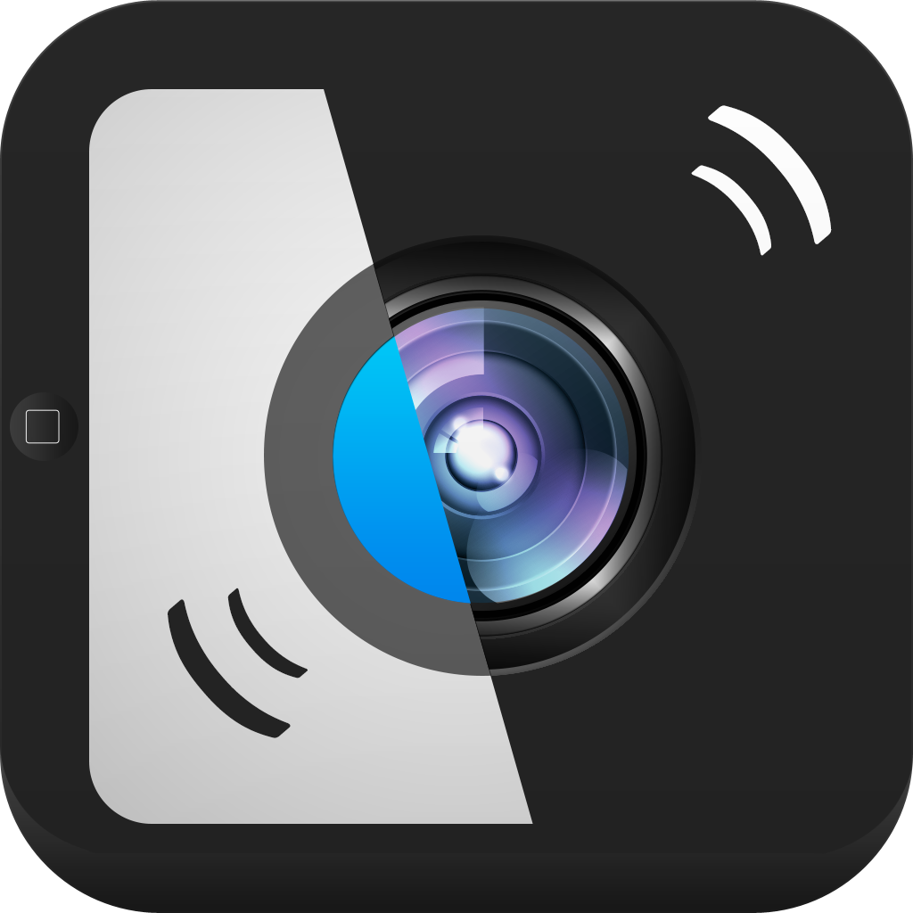

  

# Remote shutter: camera connect
---
## P2P Remote control camera

  
  
  

### Description
---
Remote Shutter is an application that requires two devices. It works on both macOS and iOS. 

With Remote Shutter one of your devices is the camera remote or camera monitor, and the other device would be set up wherever you would like to take a picture as the camera. Using the connected phone you can take pictures from up to 50 feet away.

Remote Shutter makes it easy to take pictures of things at weird angles and that would put you in an uncomfortable position. Take Remote Shutter for a spin for free!

### Features:
---
- Take pictures from up to 50ft away
- Toggle the camera orientation
- Use the camera flash
- Adjustable camera timer

### HOW TO USE
---
When you first open the app the phone will start searching for devices to connect with. The camera connects with a P2P connection to the other device. Once the devices are connected you will have to choose which device is the camera and which phone is the remote. 
1. Connect your devices
2. Choose which role the device has (camera or remote)
3. Set up & take pictures!
---