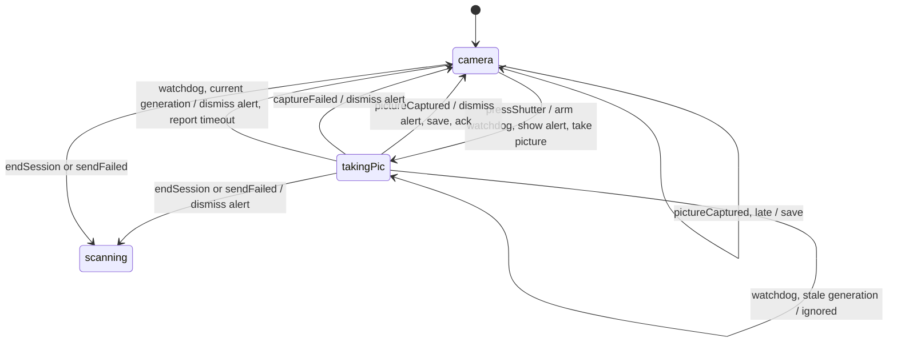

# SessionModel

The session logic as a state machine you can interrogate. Right now it covers one slice,
the photo round trip, and it is not yet wired into the app: the coordinator still runs its
own code, and this package exists so we can ask questions about that code faster than we
can run a simulator.

The plan for wiring it in is `Docs/correcto-integration.md`. This file is how to read what
is already here.

## Run it first

```bash
cd SessionModel && swift test
```

Four tests, about three milliseconds. Two of them deliberately hunt for bugs that are in
`SessionCoordinator` today, and they print the sequence that causes each one. That output
is the point of this package, so read it before reading any of the code.

## The machine

One camera. The peer, the capture hardware and the ten second watchdog are the world
around it, which is where the interesting orders come from.



### One machine, two settings

`PhotoCamera` is the model, and it is correct. Two edges above are where the coordinator
behaves differently today: abandoning a capture does not dismiss the alert, and a picture
arriving after the watchdog is dropped along with the photo.

Rather than keep a second copy of the machine, those two are parameters on `photoStep`.
`PhotoCameraAsShipped` is the same body with both switched off, and it exists for exactly
one reason: the checker has to be held to finding the defects we already know about. If it
cannot rediscover those, it should not be believed about anything else.

Both defects reproduce on the simulator in `RemoteCamTests/RemoteCamSessionTests.swift`
under `CorrectoReproductionTests`.

## How to read a trace

This is the whole skill. Run the tests and you get output like:

```
worlds explored: 6, max depth: 2
VIOLATION: an alert is up only while taking a picture
initial:
  camera: phase: camera, alertUp: false, captureOutstanding: false
1. press shutter
     [camera] pressShutter -> takingPic(generation: 1), alertUp: true
     effects: armTimeout(generation: 1), showAlert, takePicture
2. peer says goodbye
     [camera] endSession -> scanning, alertUp: true
```

Read it in this order.

**The rule that broke**, on the VIOLATION line. That is a sentence somebody wrote in
`PhotoSliceTests.swift`, and it is the only thing the checker was told to care about.

**The numbered steps.** Each is one event the world delivered. `press shutter` and `peer
says goodbye` are labels from the environment, so they read as things a person or a peer
did, not as internal function names.

**The state after each step**, which is where the bug becomes visible. Here the second
line ends in `scanning` with `alertUp: true`, and the rule says that combination cannot
exist.

**`worlds explored: 6, max depth: 2`.** Six distinct situations were reachable inside the
budgets, and the bug is two moves from the start. The search is breadth first, so nothing
shorter exists. If you ever see a trace of nine steps, there is genuinely no shorter way
to reach that bug.

## The rules, and what each is for

In `PhotoSliceTests.swift`. Three sentences, and it is worth knowing why each exists.

| Rule | Catches | Enforced in the app by |
|---|---|---|
| An alert is up only while taking a picture | the stranded "Taking picture" modal | `dismissCameraAlert()` called in three places, all inside one state's handler |
| When nothing more can happen, no capture is unaccounted for | a photo lost because it arrived after the watchdog | nothing |
| A timeout for a stale generation changes nothing | a late watchdog killing the wrong state | the generation in the state payload, which works |

The third one passes. It is the checker agreeing with a decision the team made years ago,
and it is there so that a future change cannot quietly undo it.

The second one is a terminal rule, meaning it is only checked when nothing more can
happen. Note that neither of the other two would have caught a lost photo: a list of
things that must never be true does not describe losing data to a message arriving in a
state that ignores it. That is worth remembering when adding rules of your own.

## What is modelled and what is not

In the model: the phase, whether a peer is linked, whether the alert is up, whether a
capture is outstanding, and the timeout generation.

Not in the model, and deliberately: anything with an identity or a lifetime. The camera
rig, the lobby, the alert handle itself, the two `Task` values, the real metadata. Those
stay wherever the app keeps them. The model carries the fact that an alert is up; the app
carries the alert.

Peers could go in, because `MCPeerID` here is an alias for `Stormo.PeerID`, a struct whose
equality is the peer's public key hash. This slice does not need them, since nothing in it
decides on which peer, only on whether there is one.

## Changing it

Add a rule when you find yourself writing a comment that says "this must always be true".
That comment is a sentence, and a sentence can be checked.

Two things to keep right. Every field of the state must stay plain data, or the checker
cannot compare two states and the search cannot terminate. And every action in the
environment needs a budget, or the search never ends; when you add one, check the report
says the search finished rather than stopping at a limit, because a pass that stopped
early proves nothing.

The model is a transcription of the app, so when the two disagree the first question is
which one is wrong. Often it is the model, and that is fine. The second question is worth
asking anyway.
